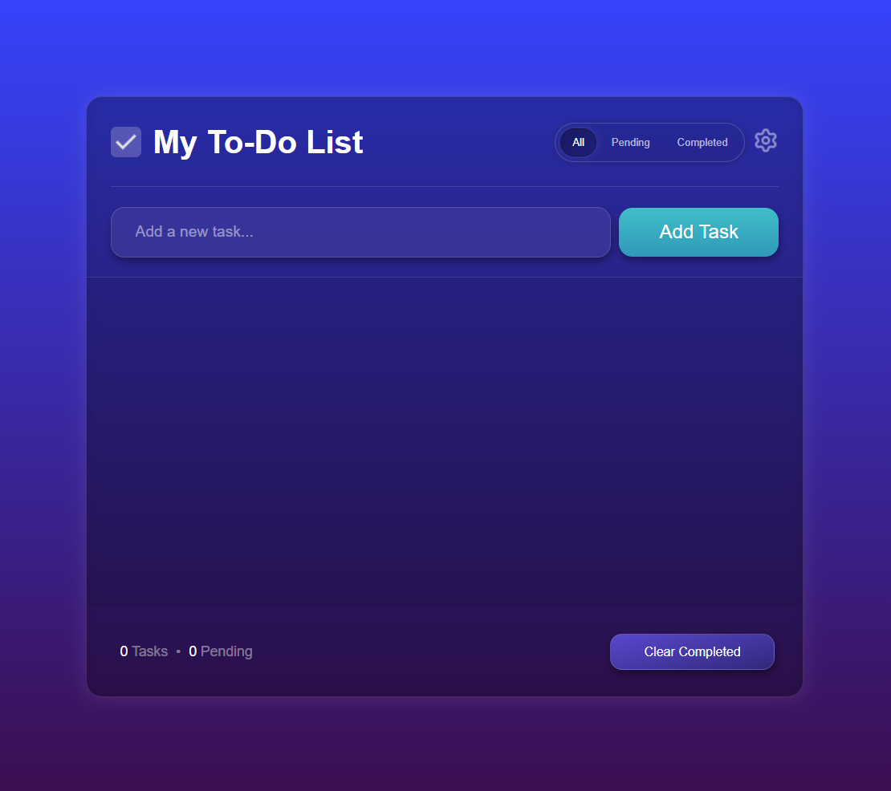
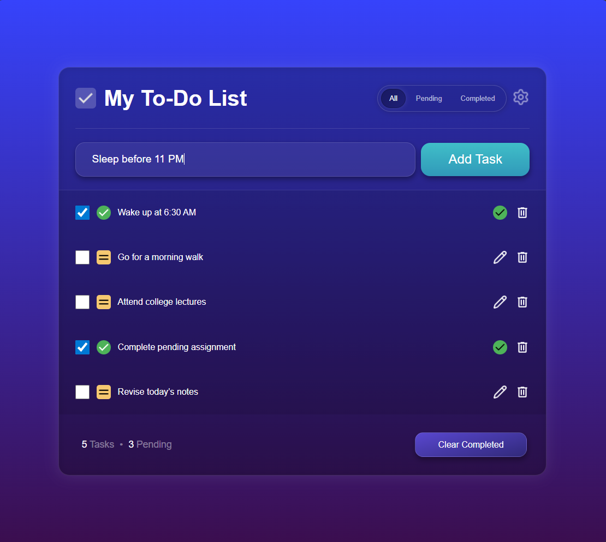
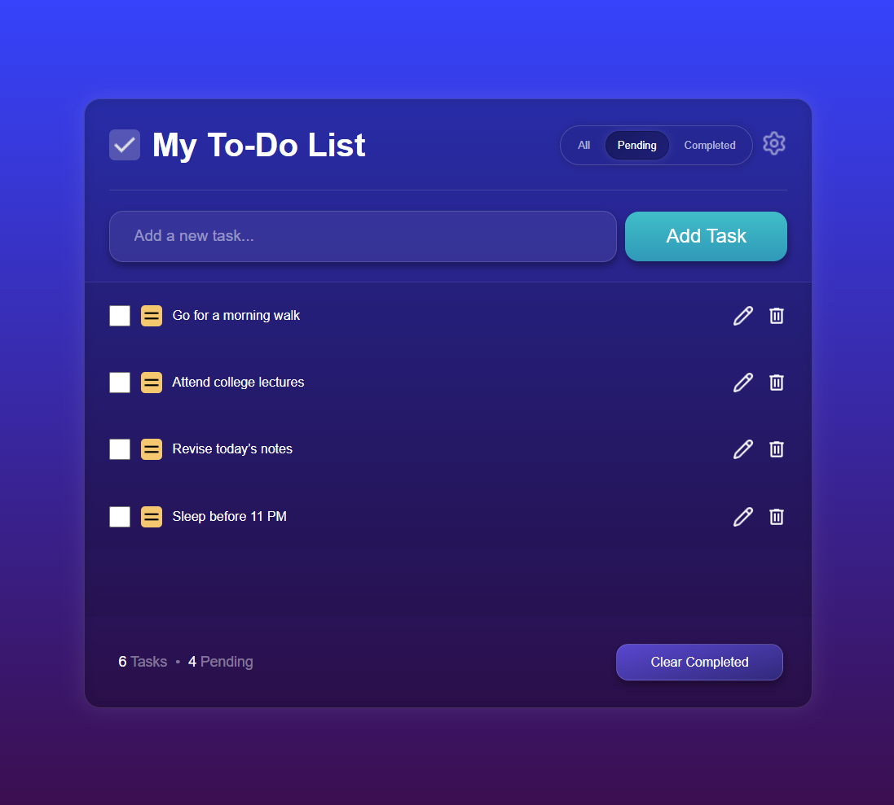
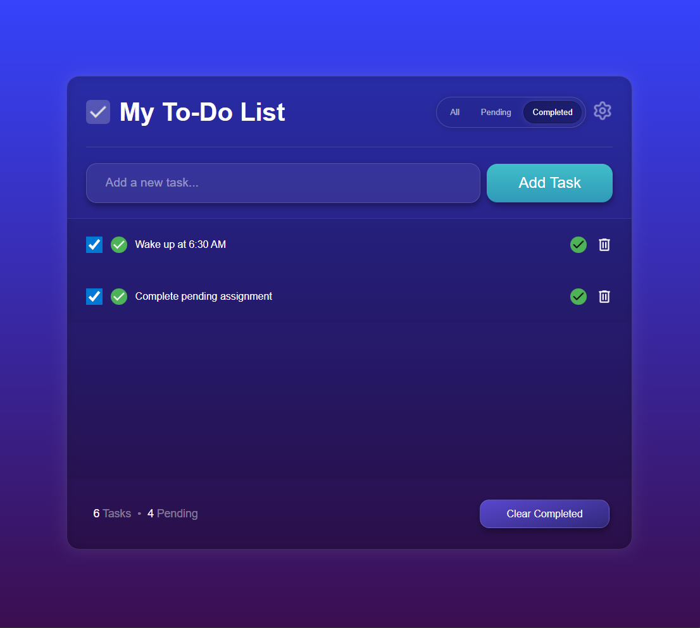
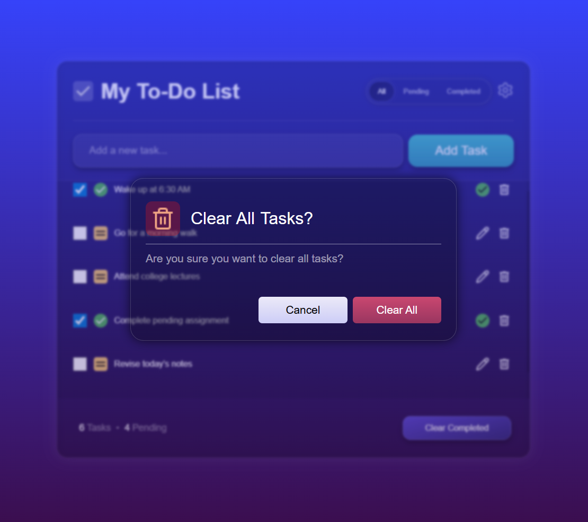

# 📝 To-Do List App

A clean, modern, and responsive **To-Do List web application** built using **HTML, CSS, and Vanilla JavaScript**.  
The app is designed to help users manage daily tasks efficiently with a focus on usability, persistence, and a polished user interface.

---

## ✨ Features

- ➕ Add new tasks
- ✏️ Edit existing tasks
- 🗑️ Delete individual tasks
- ✅ Mark tasks as completed
- 🔍 Filter tasks (All / Pending / Completed)
- 🧹 Clear completed tasks with confirmation
- ⌨️ Keyboard support for task actions (Enter to add/save, Escape to cancel / close dialogs)
- 💾 Persistent task storage
  - Tasks remain saved even after page refresh
  - Each task’s state (completed or pending) is preserved
- 📱 Fully responsive design (mobile, tablet, and desktop)

---

## 📸 Preview

### Main Application Interface

## 

---

### Adding a New Task

---

### Editing an Existing Task

---

### Task Filtering (All / Pending / Completed)

#### Pending Tasks View

#### Completed Tasks View

---

### Clear Completed Tasks Confirmation

---

## 🛠️ Tech Stack

- **HTML5** – application structure
- **CSS3** – layout, gradients, and responsive styling
- **JavaScript (Vanilla)** – application logic and DOM manipulation

> This project is built without frameworks or external libraries to strengthen core web development fundamentals.

---

## 🎯 Project Notes

- The complete application logic was **written manually**.
- **No AI tools were used to build or generate the JavaScript logic** for this project.
- This project was developed to practice:
  - JavaScript DOM manipulation
  - Managing UI state
  - Building responsive layouts
  - Writing clean and maintainable code

---

## 📌 Future Improvements

- Drag and drop task reordering
- Light / dark theme toggle
- Task priority levels
- Due date support

---

## 👤 Author

**Yashkamal**
